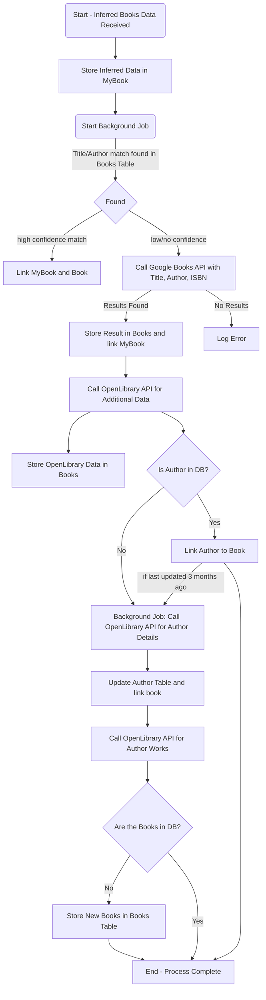

## Book Inference Architecture

This ADR is a living document that will be updated as we go along with the implementation as the book inference system is a small part of the Sovoli product.

## Status: Draft

Date: 2024-08-11

## Context

Sovoli is heavily reliant on machine learning to help users manage their books and their reading habits.

The first part of the user's journey is to input the books they own into the system. We want to make this so easy that it accepts a book image and infers the book title, author, and ISBN. Having ML process an image of the shelf instead of OCR individual books is a massive improvement over existing solutions.

ML are inference systems, which is probability and may or may not be correct.

THe system will try to resolve the inference by sending this data to API to get the top 5 books that match the inference data.

We will link to the first book in the list as the book that the inference system thinks is the best match until the user validates the inference.

There are 2 main validation methods:

1. Automatic inference validation - this validation is done by the systems such as API calls to google books api and OpenLibrary API.
2. Manual validation - this is done by the user. This will flag the book as verified.

### Issues

Currently, the API for putting books on the shelf also accepts this information, which can be a list of over 100 books.

Each book has to make a request to multiple services such as google books API and OpenLibrary API.

For each book that google books returns, we need to make another request to OpenLibrary API to get more data, the cover image and author.

As you can imagine, this is a very expensive operation and we are already running into our serverless timeout issues with just 30 books and the google books api call.

We need to come up with system design that will allow us to do this with the following principles in mind:

1. Scalable (no timeouts) - we should handle many books and account for retry mechanisms
2. Good user feedback (users should see the progress of the inference process)
3. Cheap (batching whenever we can)

## Design

Lets start with some high level design:

Scenario 1: Fresh start, no books on the shelf.

Scenario 2: Updating an existing shelf, some books are already validated on the shelf, new books are being added.

### Architecture

* API accepts a list of books.
  * the book can be inference data (title, author, isbn)
  * the book can be a known ISBN 
* Where this list is possible:
  * Shelf `PUT /users/:username/shelves/:slug`
  * List `PUT /users/:username/lists/:slug`
  * Books `PUT /users/:username/books/:slug`

This means that each individual book should user submitted book (`my-book` in the db) should handle its own inference resolution and validation.

### Db schema on insertion

We will need to store temporary data on myBooks such as what the book is inferred to be when chatGPT parses the book image.

Add a few columns:

* `inferredTitle` - the title that the inference system thinks is the best match
* `inferredAuthor` - the author that the inference system thinks is the best match
* `inferredIsbn` - the ISBN that the inference system thinks is the best match
* `triggerDevId` - the trigger dev handle id thats handling the inference population.
* `probableIsbns` - the list of ISBNs that the inference validationsystem thinks are the best match
* `verified` - a boolean that will be set to true when the inference is validated by user.
* `inferenceError` - the error that the inference system encountered, if any.

`slug` and `bookId` will be null until automatic inference validation is done.

unique index on `inferredTitle` and `inferredAuthor` to prevent duplicate inference submissions.

For the `books` table:

* `inferenceSystems` - the list of inference systems that the inference system uses to validate the inference. ie. googleBooks, openLibrary, etc

### Flow

1. User adds a book to `my-books` table with inference data.
2. Write services (shelf, mybooks, list) will call the inference service to validate the inference if inferredTitle and inferredAuthor are not null.
3. The triggerDevId should be saved to the respective myBooks record.
4. If a list of books were added, batch the triggerDev calls.

### Algorithm

**Prepare from the trigger** 

1. Get the book from the database.
2. Since the book is scanned by the spine, it is more likely that the title is correct, then less so the author and then the ISBN. So we will query using the following order:

**Google Books API Calls**

Search logic:

1. title, author, ISBN
2. if nothing is found, try title, author
3. if nothing is found, try title only

We will use the plain google books api q parameter without any filters, since the filters are giving us inacurate results during testing.

The API will return a list of books that match the query.

We will create the book and link `my-book` to it.

Also update the `inferenceSystems` column to include `googleBooks`.

*note*: We went with google api because it has a very good fuzzy search logic to find the best match.

**OpenLibrary API Calls**

For each book that google books returns, we need to make another request to OpenLibrary API to get more data, the cover image and author.

See: https://openlibrary.org/dev/docs/api/read

Update the `books` table with what we found.

Also update the `inferenceSystems` column to include `openLibrary`.

**note: include the cover image in the book record**

**Get the author**

Use the OpenLibrary API to get the authors of the book.

Update the `authors` table with what we found and link the book to the author.

See: https://openlibrary.org/dev/docs/api/authors
Example: https://openlibrary.org/authors/OL8473943A.json

Then get the books written by the authors. This should be offloaded to new background services as we do not know how far down the network it can go.

Example: https://openlibrary.org/authors/OL8473943A/works.json

Use the entries[].key to get the linked book and continue to populate the `books` table.

### Flowchart

