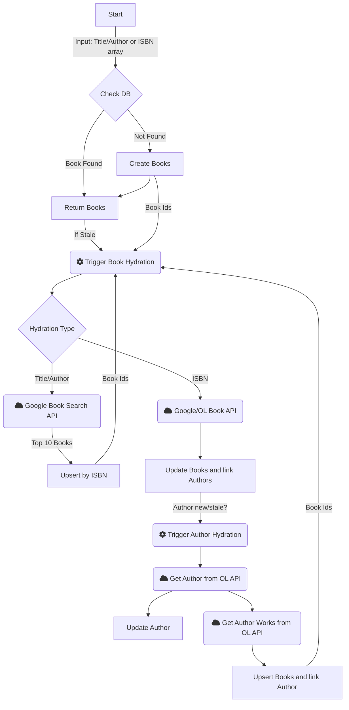

## Book Inference Architecture

This ADR is a living document that will be updated as we go along with the implementation as the book inference system is a small part of the Sovoli product.

## Status: Draft

Date: 2024-08-11

## Context

Sovoli is heavily reliant on machine learning to help users manage their books and their reading habits.

The first part of the user's journey is to input the books they own into the system. We want to make this so easy that it accepts an image of the shelf, showing the spines, which we infer the book title and author. 

*🎨 Prod Note: Having ML process an image of the shelf instead of OCR individual books is a massive improvement over existing solutions.*

However, in some cases, we may take a photo of the front of the book if there are no words on the spine. If this is the case, we are better off scanning the ISBN.

We have a few problems here:

1. Sovoli is a new system, so we won't have a lot of books in the database.
2. ML are inference systems, which is probability and may or may not be correct when using the title and author.

We need a system that will allow us to get the book using a best match algorithm. Ie. Title and Author fuzzy match. If ISBN is provided, ignore the title and author and just use the ISBN.

### Stale Data

Since we are populating the database, we need to ensure we have the latest data so we will keep track of the last updated date for each book and then we can use that to determine if the book is stale.

### Validating Inference

There are 2 main validation methods:

1. Automatic inference validation - this validation is done by the systems such as API calls to google books api and OpenLibrary API.
2. Manual validation - this is done by the user. This will flag the book as verified.

## Issues

Currently, the API for putting books on the shelf also accepts a list of book titles and authors.

See this link for efficient searching: https://chatgpt.com/share/bd4bbb76-283b-4703-9640-c27b044cc741

If there are no match in our database, the operation becomes intensive.

We need to create the book and link it to the user's `my-books` table, along with linking the ones that we find in the database.

Each book has to make a request to multiple services such as google books API and OpenLibrary API.

We need to come up with system design that will allow us to do this with the following principles in mind:

1. Scalable (no timeouts) - we should handle many books and account for retry mechanisms
2. Good user feedback (users should see the progress of the inference process)
3. Cheap (batching whenever we can)

## Design

Check the Flowchart below for a visual representation.

### Architecture

* API accepts a list of books.
  * the book can be inference data (title and author)
  * the book can be a known ISBN 
* This operation happens on the following routes:
  * Shelf `PUT /users/:username/shelves/:slug`
  * List `PUT /users/:username/lists/:slug`
  * MyBooks `PUT /users/:username/mybooks/:slug`

Since there are multiple routes that can accept a list of books, we will need to setup a centralized book inference system. One that will handle the inference, validation and refreshing of stale data.

### Db schema

`my-books` table:

* `name` - the title that the inference system thinks is the best match
* `verified` - a boolean that will be set to true when the inference is validated by user.
* `book-id` - link to the book in the `books` table

`books` table:

* `title` - the title that the inference system thinks is the best match
* `triggerDevId` - the trigger dev handle id thats handling the inference population.
* `inferenceError` - the error that the inference system encountered, if any.
* `lastGoogleUpdated` - the last time the book was updated from google books
* `lastOLUpdated` - the last time the book was updated from openlibrary

`authors` table:

* `name` - the author that the inference system thinks is the best match
* `olKey` - the openlibrary key for the author
* `triggerDevId` - the trigger dev handle id thats handling the inference population.
* `inferenceError` - the error that the inference system encountered, if any.
* `lastUpdated` - the last time the author was updated

### Flow

Scenario 1: User sends a list of books with title and author.

Route: `PUT /users/:username/mybooks/:slug`
Route: `PUT /users/:username/shelves/:slug` - create a shelf with the books

1. Get the books from the inference system.
2. If the book is not found, the inference system will create it and kick off a background job to hydrate the book. This also happens if the book is stale.
3. We then add these books to the `my-books` table.
4. We will try to return the books to the user as early as possible. We will try to ensure that the book also contains the triggerDevId so that we can keep track of the book hydration.

**caveat**: we will only allow a user to have one of each book when using this route with title and author.

### Background Algorithm

The background hydration algorithm will be triggered by sending the id of the book. Whenever possible, we will batch trigger this.

**Prepare from the trigger** 

1. Get the book from the database.
2. If there is no ISBN, we will need to search for the book using the title and author.
3. If there is an ISBN, run the ISBN Hydration algorithm.

**Google Books API Calls**

Since the book is scanned by the spine, it is more likely that the title is correct, then less so the author. So we will query using the following order:

1. title, author
2. if nothing is found, try title only

We will use the plain google books api q parameter without any filters, since the filters are giving us inaccurate results during testing.

The API will return a list of books that match the query.

*note*: We went with google api because it has a very good fuzzy search logic to find the best match.

**After Google Books API Calls**

3. For each of the books returned, we will upsert the `books` table with relevant data. This means we will add the other books that are returned from google books. We will ensure we update the `lastGoogleUpdated` column as this is used to determine if the book is stale, so we do not rerun the google API again.
4. We now have a list of books that we will need to hydrate again using the OL API. So we will trigger a batch of the hydration background job again.

**Hydration Algorithm**

We will check the lastUpdated columns for google and openlibrary. If either is stale, we will update either in parallel:

**OpenLibrary:**

See: https://openlibrary.org/dev/docs/api/read

**note: include the cover image in the book record**

**Google Books:**

See: https://developers.google.com/books/docs/overview

We will use the author from the OL API to update the `authors` table. So we will run an upsert on the `authors` table that is linked to the book using the OLKey.

However, we need to hydrate the author some more since OL does not return everything about the author.

So if the author is new or stale (no or old lastUpdated), we will trigger a background job to hydrate the author.

This will also be batched when possible as the book may have many authors.

**Hydrate Author Algorithm**

Hydrate a single author by the author id.

1. Get the author from the Db.
2. If there is no OLKey, we will need to search for the author using the name.
3. If the author is stale (or newly found from search), we will need to call the OL API to get the author's complete data.

See: https://openlibrary.org/dev/docs/api/authors
Example: https://openlibrary.org/authors/OL8473943A.json

4. Then get the books written by the authors.

Example: https://openlibrary.org/authors/OL8473943A/works.json

We will create upserts on the `books` table for each book returned. Get all the ids and then batch trigger the hydration background job for books again. We will not set the lastUpdatedOL since this call does not return the full data.

### Flowchart

