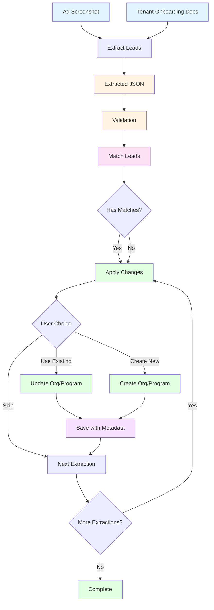

# Lead Extraction Pipeline

## Overview

The lead extraction pipeline processes ad screenshots and tenant onboarding documents to extract structured evidence about educational programs and organizations. The extracted data is then transformed and matched against existing organizations or used to propose new tenants.

## Pipeline Flow



## Usage

### Prerequisites

1. Install Gemini CLI:
   ```bash
   npm install -g @google/gemini-cli
   ```

2. Authenticate with Gemini CLI (run once):
   ```bash
   gemini
   ```
   This will open a browser to authenticate. Credentials are cached for future use.

   Alternatively, set an API key in your `.env` file:
   ```bash
   GEMINI_API_KEY=your_api_key_here
   ```

### Running the CLI

**Default behavior** - Process all unprocessed images in the inputs directory (in parallel):
```bash
pnpm --filter @sovoli/cli sovoli extract-leads
```

Or add to root `package.json`:
```json
{
  "scripts": {
    "cli": "pnpm --filter @sovoli/cli sovoli"
  }
}
```

Then use:
```bash
pnpm cli extract-leads
```

The CLI will:
- Read the registry to identify already-processed images
- Skip images that have been successfully processed
- Process remaining images in parallel
- Save extracted JSON files to `data/leads/extractions/`
- Update the registry to track processed images
- Validate extracted JSON against the schema

Process specific image(s) (optional):
```bash
pnpm cli extract-leads "data/leads/inputs/images/IMG_6245.PNG"
```

**Step 2: Match Leads**

After extraction, match the extracted data to existing organizations and programs:
```bash
pnpm cli match-leads
```

This will:
- Find all extraction files
- Match business names to existing organizations
- Match program names to existing programs within matched orgs
- Save match results to extraction JSON files

**Step 3: Apply Changes**

After matching, interactively apply the changes:
```bash
pnpm cli apply-changes
```

This will:
- Loop through all extraction files
- For each extraction, prompt you to use existing org, create new org, or skip
- For each program, prompt you to update existing program, create new program, or skip
- Show diffs before applying changes
- Require confirmation before saving
- Add change tracking metadata to all updates

## Directory Structure

```
data/leads/
├── inputs/
│   ├── images/        # Screenshots from localsend (gitignored)
│   └── registry.json  # State tracking (gitignored)
└── extractions/       # Extracted JSON files (committed)

apps/sovoli.com/src/modules/leads/extraction/
├── types.ts           # TypeScript types and Zod schemas
└── validate.ts       # Validation functions
```

## File Naming

- **Extracted JSON**: `{base-image-name}-extraction.json` (e.g., `IMG_6245-extraction.json`)

## Extraction Schema

The extraction schema is designed to align with target types (`Org`, `Program`, `Contact`, `SocialLink`) while preserving all raw extracted data.

### Schema Structure

```typescript
{
  artifact: {
    id: string
    source: {
      ingest_method: "manual_upload" | "file_read" | "api_ingest"
      platform_hint: string | null
      captured_at: string | null  // ISO-8601
      locale_hint: string | null
    }
    file: {
      filename: string | null
      hash: string | null
    }
  }
  extraction: {
    programs: Array<{
      id: string
      name: string
      quickFacts?: string[]
      pricing?: {
        registration?: Array<{
          amount: string
          currency?: string
          label?: string
          notes?: string
        }>
        tuition?: Array<{
          amount: string
          currency?: string
          label?: string
          billingCycle?: string
          notes?: string
        }>
        materials?: Array<{
          amount: string
          currency?: string
          label?: string
          notes?: string
        }>
        paymentPlans?: string[]
        other?: string[]
      }
      schedule?: {
        days?: string[]
        times?: string[]
        dates?: string[]
        duration?: string
      }
      location?: string | null
      callsToAction?: string[]
    }>
    contacts: {
      phones: Array<{
        value: string
        type?: "phone" | "whatsapp"
      }>
      emails: Array<{
        value: string
      }>
    }
    socialLinks: Array<{
      platform: "facebook" | "instagram" | "youtube" | "x" | "website" | "other"
      handle?: string
      url?: string
      value: string
    }>
    urls?: string[]
    locations?: string[]
    platformSignals?: string[]
  }
  business: string[]
}
```

### Key Features

1. **Pricing Separation**: Registration, tuition, and materials fees are extracted separately to map directly to `PricingItem[]` with `purpose` field
2. **Type Alignment**: Field names align with target types (`socialLinks` → `Org.socialLinks`, etc.)
3. **Raw Data Preservation**: All extracted values are preserved as strings for later parsing/transformation
4. **Structured Evidence**: Evidence is structured to make transformation paths clear
5. **Business Identification**: The `business` field contains an array of business name candidates, ordered by likelihood. The most likely business name is at index 0, with additional candidates (if any) following in descending order of likelihood. Returns an empty array if no business name can be determined.

## Transformation Mapping

### Organization Mapping

| Extraction Field | Target Type | Transformation Notes |
|-----------------|-------------|---------------------|
| `business[0]` | `Org.name` | Use primary (first) business name candidate |
| `contacts.phones[]` | `Org.locations[].contacts: Contact[]` | Convert to `Contact` with `type: "phone" \| "whatsapp"` |
| `contacts.emails[]` | `Org.locations[].contacts: Contact[]` | Convert to `Contact` with `type: "email"` |
| `socialLinks[]` | `Org.socialLinks: SocialLink[]` | Convert handles to URLs, map platform |
| `locations[]` | `Org.locations: OrgLocation[]` | Parse address strings, geocode if needed |

### Program Mapping

| Extraction Field | Target Type | Transformation Notes |
|-----------------|-------------|---------------------|
| `programs[].name` | `Program.name` | Direct mapping |
| `programs[].quickFacts[]` | `Program.quickFacts[]` | Direct mapping (marketing/descriptors) |
| `programs[].whatYouWillLearn[]` | `Program.whatYouWillLearn[]` | Direct mapping (learning content - transformation to structured format happens later) |
| `programs[].pricing.registration[]` | `Program.cycles[].pricingPackage.pricingItems[]` | Map to `PricingItem` with `purpose: "registration"` |
| `programs[].pricing.tuition[]` | `Program.cycles[].pricingPackage.pricingItems[]` | Map to `PricingItem` with `purpose: "tuition"` |
| `programs[].pricing.materials[]` | `Program.cycles[].pricingPackage.pricingItems[]` | Map to `PricingItem` with `purpose: "materials"` |
| `programs[].pricing.paymentPlans[]` | `Program.cycles[].pricingPackage.paymentSplits[]` | Parse payment plan details |
| `programs[].schedule` | `Program.cycles[]: ProgramCycle` | Parse dates, create `OrgAcademicCycle` |
| `programs[].location` | `Program.cycles[].location` or `Org.locations[]` | Parse address string |

## Processing Steps

### 1. Org Matching

**Status**: ✅ Implemented

Match extracted organizations against existing orgs using:
- Organization name (fuzzy matching)
- Phone numbers
- Email addresses
- Social media handles
- Location (if available)

**Output**: Match confidence score and matched org ID (if found)

**Usage**:
```bash
pnpm cli match-leads
```

This command:
- Discovers all organizations in the system
- Matches each extraction file's business name against existing orgs
- Matches programs within each extraction against programs in matched orgs
- Saves match results to extraction JSON files (`matchedOrgs` and `matchedPrograms` fields)

### 2. Apply Changes

**Status**: ✅ Implemented

Interactive command to apply extraction data to organizations and programs with human confirmation.

**Usage**:
```bash
pnpm cli apply-changes
```

**What it does**:
1. Loads all extraction files from `data/leads/extractions/`
2. For each extraction:
   - Shows matched organizations (from `matchedOrgs` field)
   - Prompts user to: Use existing org, Create new org, or Skip
   - If using existing org: Shows diff of changes and confirms before applying
   - If creating new org: Prompts for category, country, region, and username
3. For each program in the extraction:
   - Shows matched programs (from `matchedPrograms` field)
   - Prompts user to: Update existing program, Create new program, or Skip
   - Shows diff of changes and confirms before applying

**Safety Features**:
- **Diff preview**: Always shows what will change before applying
- **Confirmation required**: User must confirm each change
- **Skip option**: User can skip any extraction/program
- **Change tracking**: Metadata flags (`_addedAt`, `_updatedAt`, `_updatedFields`, `_source`) track what was added/updated

**Change Tracking Metadata**:
When changes are applied, metadata is added to track:
- `_addedAt`: ISO timestamp when org/program was created (new records only)
- `_updatedAt`: ISO timestamp when org/program was last updated
- `_updatedFields`: Array of field names that were updated
- `_source`: Extraction file ID that provided the data

**Example Workflow**:
1. Run `extract-leads` to extract data from images
2. Run `match-leads` to find matching orgs and programs
3. Run `apply-changes` to interactively apply the changes:
   - Review each extraction
   - Choose which org to update or create new
   - Review diffs for each program
   - Confirm changes before applying

## Validation

Use the TypeScript validation module for full schema validation:

```typescript
import { validateLeadExtraction } from "~/modules/leads/extraction/validate";

const result = validateLeadExtraction(extractedData);
if (!result.success) {
  console.error(result.message);
} else {
  // result.data is fully typed LeadExtractionDocument
}
```

## Transformation Utilities (Future)

Helper functions to transform extraction → target types:
- `extractOrganizationName(extraction)` → primary org name
- `extractContacts(extraction)` → `Contact[]`
- `extractSocialLinks(extraction)` → `SocialLink[]`
- `extractPrograms(extraction)` → `Program[]` (with cycles, pricing, etc.)
- `parseLocationString(location)` → `Address` (geocoding/parsing)
- `parsePricingEvidence(pricing)` → `PricingPackage` (separate registration/tuition/materials, currency detection, parse amounts)
