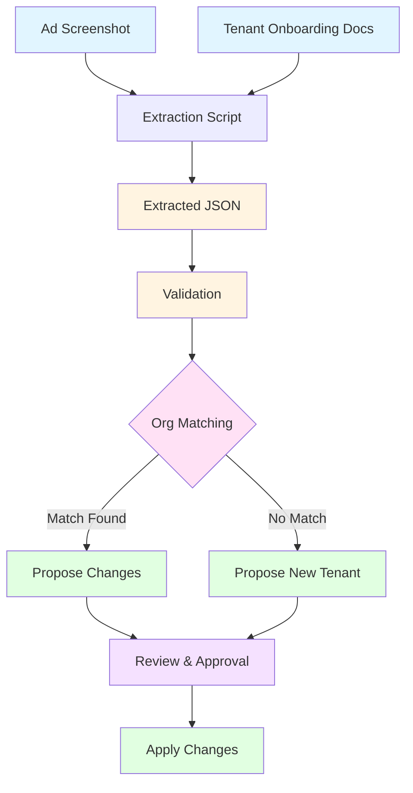

# Lead Extraction Pipeline

## Overview

The lead extraction pipeline processes ad screenshots and tenant onboarding documents to extract structured evidence about educational programs and organizations. The extracted data is then transformed and matched against existing organizations or used to propose new tenants.

## Pipeline Flow



## Usage

### Prerequisites

1. Install Gemini CLI:
   ```bash
   npm install -g @google/gemini-cli
   ```

2. Authenticate with Gemini CLI (run once):
   ```bash
   gemini
   ```
   This will open a browser to authenticate. Credentials are cached for future use.

   Alternatively, set an API key in your `.env` file:
   ```bash
   GEMINI_API_KEY=your_api_key_here
   ```

### Running the CLI

**Default behavior** - Process all unprocessed images in the inputs directory (in parallel):
```bash
pnpm --filter @sovoli/cli sovoli extract-leads
```

Or add to root `package.json`:
```json
{
  "scripts": {
    "cli": "pnpm --filter @sovoli/cli sovoli"
  }
}
```

Then use:
```bash
pnpm cli extract-leads
```

The CLI will:
- Read the registry to identify already-processed images
- Skip images that have been successfully processed
- Process remaining images in parallel
- Save extracted JSON files to `data/leads/extractions/`
- Update the registry to track processed images
- Validate extracted JSON against the schema

Process specific image(s) (optional):
```bash
pnpm cli extract-leads "data/leads/inputs/images/IMG_6245.PNG"
```

## Directory Structure

```
data/leads/
├── inputs/
│   ├── images/        # Screenshots from localsend (gitignored)
│   └── registry.json  # State tracking (gitignored)
└── extractions/       # Extracted JSON files (committed)

apps/sovoli.com/src/modules/leads/extraction/
├── types.ts           # TypeScript types and Zod schemas
└── validate.ts       # Validation functions
```

## File Naming

- **Extracted JSON**: `{base-image-name}-extraction.json` (e.g., `IMG_6245-extraction.json`)

## Extraction Schema

The extraction schema is designed to align with target types (`Org`, `Program`, `Contact`, `SocialLink`) while preserving all raw extracted data.

### Schema Structure

```typescript
{
  artifact: {
    id: string
    source: {
      ingest_method: "manual_upload" | "file_read" | "api_ingest"
      platform_hint: string | null
      captured_at: string | null  // ISO-8601
      locale_hint: string | null
    }
    file: {
      filename: string | null
      hash: string | null
    }
  }
  extraction: {
    organizationNames: Array<{
      id: string
      name: string
      confidence?: "high" | "medium" | "low"
    }>
    programs: Array<{
      id: string
      name: string
      quickFacts?: string[]
      pricing?: {
        registration?: Array<{
          amount: string
          currency?: string
          label?: string
          notes?: string
        }>
        tuition?: Array<{
          amount: string
          currency?: string
          label?: string
          billingCycle?: string
          notes?: string
        }>
        materials?: Array<{
          amount: string
          currency?: string
          label?: string
          notes?: string
        }>
        paymentPlans?: string[]
        other?: string[]
      }
      schedule?: {
        days?: string[]
        times?: string[]
        dates?: string[]
        duration?: string
      }
      location?: string | null
      callsToAction?: string[]
    }>
    contacts: {
      phones: Array<{
        value: string
        type?: "phone" | "whatsapp"
      }>
      emails: Array<{
        value: string
      }>
    }
    socialLinks: Array<{
      platform: "facebook" | "instagram" | "youtube" | "x" | "website" | "other"
      handle?: string
      url?: string
      value: string
    }>
    urls?: string[]
    locations?: string[]
    platformSignals?: string[]
  }
  entityCandidates: Array<{
    id: string
    type: "organization" | "program" | "phone" | "email" | "social_link" | "website"
    ref: string
    value?: string
  }>
}
```

### Key Features

1. **Pricing Separation**: Registration, tuition, and materials fees are extracted separately to map directly to `PricingItem[]` with `purpose` field
2. **Type Alignment**: Field names align with target types (`organizationNames` → `Org.name`, `socialLinks` → `Org.socialLinks`, etc.)
3. **Raw Data Preservation**: All extracted values are preserved as strings for later parsing/transformation
4. **Structured Evidence**: Evidence is structured to make transformation paths clear

## Transformation Mapping

### Organization Mapping

| Extraction Field | Target Type | Transformation Notes |
|-----------------|-------------|---------------------|
| `organizationNames[0].name` | `Org.name` | Use primary (first) organization name |
| `contacts.phones[]` | `Org.locations[].contacts: Contact[]` | Convert to `Contact` with `type: "phone" \| "whatsapp"` |
| `contacts.emails[]` | `Org.locations[].contacts: Contact[]` | Convert to `Contact` with `type: "email"` |
| `socialLinks[]` | `Org.socialLinks: SocialLink[]` | Convert handles to URLs, map platform |
| `locations[]` | `Org.locations: OrgLocation[]` | Parse address strings, geocode if needed |

### Program Mapping

| Extraction Field | Target Type | Transformation Notes |
|-----------------|-------------|---------------------|
| `programs[].name` | `Program.name` | Direct mapping |
| `programs[].quickFacts[]` | `Program.quickFacts[]` | Direct mapping (marketing/descriptors) |
| `programs[].whatYouWillLearn[]` | `Program.whatYouWillLearn[]` | Direct mapping (learning content - transformation to structured format happens later) |
| `programs[].pricing.registration[]` | `Program.cycles[].pricingPackage.pricingItems[]` | Map to `PricingItem` with `purpose: "registration"` |
| `programs[].pricing.tuition[]` | `Program.cycles[].pricingPackage.pricingItems[]` | Map to `PricingItem` with `purpose: "tuition"` |
| `programs[].pricing.materials[]` | `Program.cycles[].pricingPackage.pricingItems[]` | Map to `PricingItem` with `purpose: "materials"` |
| `programs[].pricing.paymentPlans[]` | `Program.cycles[].pricingPackage.paymentSplits[]` | Parse payment plan details |
| `programs[].schedule` | `Program.cycles[]: ProgramCycle` | Parse dates, create `OrgAcademicCycle` |
| `programs[].location` | `Program.cycles[].location` or `Org.locations[]` | Parse address string |

## Future Processing Steps

### 1. Org Matching

**Status**: Not yet implemented

Match extracted organizations against existing orgs using:
- Organization name (fuzzy matching)
- Phone numbers
- Email addresses
- Social media handles
- Location (if available)

**Output**: Match confidence score and matched org ID (if found)

### 2. Change Proposal (Existing Orgs)

**Status**: Not yet implemented

For matched organizations, propose changes:
- New programs to add
- Updated contact information
- New social links
- Updated pricing
- New locations

**Output**: Structured change proposal with:
- Field-level diffs
- Confidence scores
- Source references (extraction IDs)

### 3. New Tenant Proposal (Unmatched Orgs)

**Status**: Not yet implemented

For unmatched organizations, propose new tenant creation:
- Complete `Org` structure from extraction
- Initial `AcademicModule` with extracted programs
- Contact information
- Social links
- Locations (if available)

**Output**: Complete `OrgInstance` proposal ready for review

### 4. Review & Approval

**Status**: Not yet implemented

Manual review step before applying changes:
- Review proposed changes/new tenants
- Approve/reject/modify proposals
- Apply approved changes to database

## Validation

Use the TypeScript validation module for full schema validation:

```typescript
import { validateLeadExtraction } from "~/modules/leads/extraction/validate";

const result = validateLeadExtraction(extractedData);
if (!result.success) {
  console.error(result.message);
} else {
  // result.data is fully typed LeadExtractionDocument
}
```

## Transformation Utilities (Future)

Helper functions to transform extraction → target types:
- `extractOrganizationName(extraction)` → primary org name
- `extractContacts(extraction)` → `Contact[]`
- `extractSocialLinks(extraction)` → `SocialLink[]`
- `extractPrograms(extraction)` → `Program[]` (with cycles, pricing, etc.)
- `parseLocationString(location)` → `Address` (geocoding/parsing)
- `parsePricingEvidence(pricing)` → `PricingPackage` (separate registration/tuition/materials, currency detection, parse amounts)
